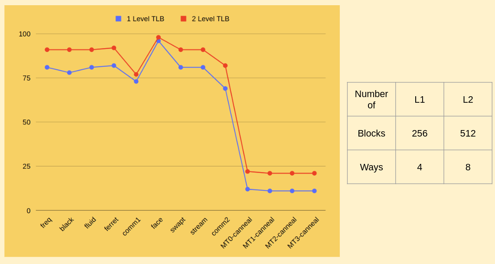

## TLB Controller

### Download input benchmark files
[google drive mirror](https://drive.google.com/file/d/1EG_eODumN_AEQecLzZrg_a1IcUr7ZmjT/view?usp=sharing)

---

### Compile and run the benchmark
```bash
# Download the source code
$ git clone https://github.com/0mega28/TLB-Controller

# cd to src direcory
$ cd TLB-Controller/src

# Place the input.tar.gz in the src directory and extract it
$ tar -xvf input.tar.gz

# Create the output directory
$ mkdir output

# Compile the code and run the benchmark
$ make -j$(nproc)
```

---

### Code organization


---

### Cache design


---

### Results

